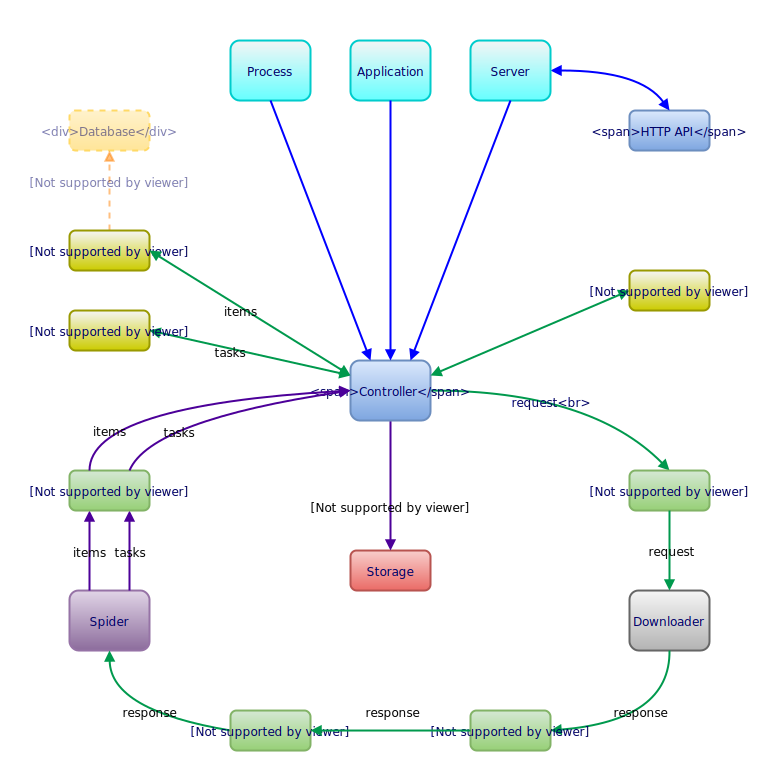

# Architecture

This page of the documentation explains technical details of okami architecture.

## Process

### Initialising

1. [Spider](api.md#spider) object is created and settings are loaded
2. Pipelines and middlewares are loaded and initialised
3. Startup pipeline is executed and finished
4. Start page from spider is queued

Scraping process starts.

### Processing

1. [Request](api.md#request) is created with a [Task](api.md#task) object
2. [Request](api.md#request) is passed through http middleware *before* cycle
3. [Downloader](api.md#downloader) processes [Request](api.md#request) and creates [Response](api.md#response)
4. [Response](api.md#response) is passed through http middleware *after* cycle
5. Errors from request/response cycle are handled as well as throttling
6. [Task](api.md#task) and [Response](api.md#response) are passed through spider middleware *before* cycle  
7. Spider processes [Task](api.md#task) and [Response](api.md#response) and creates a list of new [Task](api.md#task) and [Item](api.md#item) objects
8. [Task](api.md#task), [Response](api.md#response), list of [Task](api.md#task) and [Item](api.md#item) objects are passed through spider middleware *after* cycle  
9. List of [Item](api.md#item) objects is passed through items pipeline cycle
10. List of [Task](api.md#task) objects is passed through tasks pipeline cycle

Processing part is repeated for every task or page until exhausted.

### Finalising

1. Session object is closed
2. Pipelines and middlewares are finalised

Okami terminates.

## Schema

